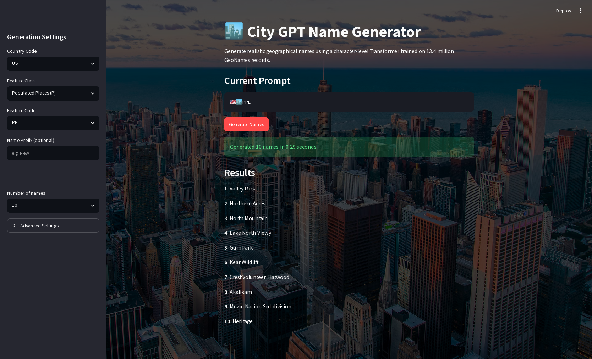

# City GPT



A character-level Transformer trained on the [GeoNames allCountries](https://download.geonames.org/export/dump/) dataset, following [Andrej Karpathy's GPT](https://github.com/karpathy/ng-video-lecture/blob/master/gpt.py) architecture.

## What it does

The model learns to generate geographic place records in the format:

```
🇺🇸🏙️PPL|new york city
🇬🇧⛰️MT|ben nevis
🇯🇵🏙️PPLC|tokyo
🇩🇪💧LK|bodensee
```

- **Flag emoji** — ISO country code as Unicode regional indicators (🇺🇸, 🇬🇧, …)
- **Class emoji** — GeoNames feature class (🏙️ city, ⛰️ terrain, 💧 water, …)
- **Feature code** — raw GeoNames code (PPL, MT, ADM1, …)
- **Name** — normalized lowercase ASCII

## Quickstart

```bash
# Install dependencies
uv sync

# Download + preprocess (~1.5 GB download, ~5-10 min)
uv run city_gpt.py prepare

# Train (5000 steps, saves checkpoint every 100 steps)
uv run city_gpt.py train

# Generate city records
uv run city_gpt.py generate
uv run city_gpt.py generate --prompt "🇺🇸🏙️PPL|new" --temperature 0.8 --top-k 50
```

Use `--max-rows N` for a quick experiment:

```bash
uv run city_gpt.py prepare --max-rows 500000
```

## Kaggle

Open the notebook directly:

[](https://kaggle.com/kernels/welcome?src=https://github.com/igui/city-gpt/blob/main/city_gpt.ipynb)

The notebook downloads data to `/kaggle/working/` (ephemeral, rebuilt each session) and saves the model checkpoint there too — checkpoints persist across sessions up to Kaggle's 20 GB output quota.

## Architecture

Identical to Karpathy's `gpt.py`:

| Hyperparameter | Value |
|---|---|
| Layers | 6 |
| Heads | 6 |
| Embedding dim | 384 |
| Context length | 256 |
| Parameters | ~10.8M |
| Vocab size | 106 tokens |

## Inspecting the data

```bash
uv run inspect_db.py --n 10 --seed 42
```

Shows raw records with token IDs, annotated breakdowns, and prefix/name lengths.

## Vocab design

```
id 0   <SOS>   start-of-sequence
id 1   \n      end-of-sequence
id 2+  ...     sorted ASCII + emoji characters
```

Total: **106 tokens** — 67 ASCII, 38 emoji (26 regional indicators + 9 class emojis + misc), 1 special.
